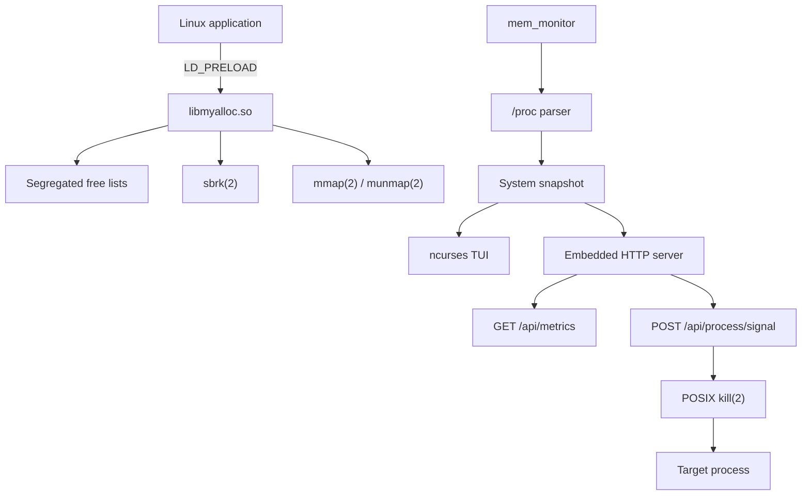

<div align="center">

# Linux Dynamic Memory Allocation & System Task Manager

**A Linux systems-programming project that combines a custom malloc-family allocator with real-time process, CPU, memory, and control-plane tooling.**

[](https://github.com/tejaswin-amara/Linux-Dynamic-Memory-Allocation-and-Memory-Monitoring-System/actions/workflows/ci.yml)
[](https://en.cppreference.com/w/c/11)
[](https://www.kernel.org/)
[](https://pubs.opengroup.org/onlinepubs/9699919799/)
[](https://invisible-island.net/ncurses/)
[](https://valgrind.org/)
[](LICENSE)

[Overview](#overview) · [Architecture](#architecture) · [Quick Start](#quick-start) · [CLI](#running-the-monitor) · [API](#http-api) · [Testing](#verification) · [Repository](#repository-map) · [Docs](#documentation)

</div>

---

## Overview

This repository is a low-level Linux systems project for **KLEF 25CS2104E: Outside-In Operating Systems & Systems Programming**.

It contains two closely related subsystems:

1. **`libmyalloc.so`** — a custom allocator and `LD_PRELOAD` interposer implementing `malloc`, `free`, `calloc`, `realloc`, `posix_memalign`, `aligned_alloc`, and `reallocarray`.
2. **`mem_monitor`** — a process and system monitor that reads Linux `/proc`, exposes an interactive `ncurses` UI, and serves a small embedded HTTP dashboard/API.

The project is deliberately built with a small dependency surface: C11, Linux/POSIX APIs, `make`, `ncurses`, and standard verification tools.

> **Design principle:** keep the interfaces small, make failure modes explicit, and verify behavior with repeatable build, test, sanitization, leak-check, stress, and benchmark targets.

## What it demonstrates

| Area | Implementation |
|---|---|
| Custom memory management | Segregated free lists, best-fit search, splitting, bidirectional coalescing |
| Virtual memory | `sbrk(2)` for heap-backed blocks and `mmap(2)`/`munmap(2)` for large allocations |
| Heap integrity | Header/footer magic values, double-free checks, integrity verification |
| Alignment | 16-byte payload alignment |
| Process telemetry | CPU, RAM, Swap, process state, RSS, VM size, thread count, context switches |
| Linux introspection | `/proc/stat`, `/proc/meminfo`, `/proc/[pid]/stat`, `/proc/[pid]/status`, `/proc/[pid]/maps` |
| Concurrency | `pthread_mutex_t`, `pthread_rwlock_t`, detached HTTP client workers |
| Terminal UX | `ncurses`, live process table, sorting, navigation, signal actions |
| HTTP control plane | Embedded TCP/HTTP server, JSON telemetry, token-protected signal endpoint |
| Verification | Unity tests, integration tests, XSS checks, ASan/UBSan, Valgrind, soak tests, benchmarks |
| Tooling | Strict compiler warnings, clang-format, Lefthook hooks, CI on GCC + Clang |

## Core design numbers

| Contract | Value |
|---|---:|
| Allocator size classes | **8** |
| Large-allocation threshold | **128 KiB** |
| Payload alignment | **16 bytes** |
| Header magic | `0xDEADBEEF` |
| Footer magic | `0xBEEFDEAD` |
| Max tracked processes per snapshot | **2048** |
| HTTP client workers | **32** |
| TUI refresh loop | **250 ms** |
| Headless monitoring loop | **1 s** |
| Browser telemetry polling | **1 s** |
| Default bind address | `127.0.0.1` |
| Default HTTP port | **8080** |

---

## Architecture

The system is intentionally split into small modules with clear boundaries:



### Memory allocator

Freed heap blocks are grouped into eight doubly linked size classes:

| Class | Maximum block size |
|---:|---:|
| 0 | 128 bytes |
| 1 | 256 bytes |
| 2 | 512 bytes |
| 3 | 1 KiB |
| 4 | 2 KiB |
| 5 | 4 KiB |
| 6 | 8 KiB |
| 7 | 128 KiB |

Within the starting class, the allocator searches for the smallest adequate free block and then escalates to larger classes when necessary.

Allocation policy:

- **When the total block size is below 128 KiB:** search the segregated free lists; request more heap space with `sbrk(2)` only when no suitable free block exists.
- **When the total block size is 128 KiB or larger:** allocate directly with anonymous `mmap(2)`.
- **Freeing heap blocks:** validate boundary markers, mark the block free, coalesce with adjacent free blocks when possible, then reinsert the merged block.
- **Freeing mapped blocks:** release the mapping with `munmap(2)`.

### Heap metadata

Each allocation carries metadata around the user payload:

```text
┌──────────────────────┐
│ Header               │
│ magic = 0xDEADBEEF   │
│ requested_size       │
│ block_size           │
│ flags + links        │
├──────────────────────┤
│ 16-byte aligned data │  ← returned pointer
│ ...                  │
├──────────────────────┤
│ Footer               │
│ magic = 0xBEEFDEAD   │
│ block_size           │
└──────────────────────┘
```

Integrity is checked during deallocation and through `allocator_verify_integrity()`. The test suite also exercises double-free, use-after-free via `realloc`, canary corruption, overflow rejection, multithreaded allocation, and coalescing.

### Process monitor

`mem_monitor` samples the Linux `/proc` filesystem and builds a bounded in-memory snapshot.

It reads:

- `/proc/stat` for system CPU jiffies
- `/proc/meminfo` for RAM and Swap counters
- `/proc/<pid>/stat` for process CPU time, state, priority, thread count, and start time
- `/proc/<pid>/status` for RSS, VM size, and context-switch counters
- `/proc/<pid>/maps` through an explicit parser API when virtual mappings are requested

CPU percentages are derived from successive jiffy snapshots:

```text
Δproc_time = (utime₂ + stime₂) - (utime₁ + stime₁)
Δsystem_jiffies = total_jiffies₂ - total_jiffies₁

CPU % = (Δproc_time / Δsystem_jiffies) × 100 × N_cores
```

The implementation tracks up to `MAX_PROCS = 2048` processes in one snapshot.

---

## Quick Start

### 1. Install dependencies

On Ubuntu/Debian:

```bash
sudo apt-get update
sudo apt-get install -y build-essential gcc clang make clang-format \
  valgrind libncurses-dev curl nodejs
```

### 2. Build

```bash
git clone https://github.com/tejaswin-amara/Linux-Dynamic-Memory-Allocation-and-Memory-Monitoring-System.git
cd Linux-Dynamic-Memory-Allocation-and-Memory-Monitoring-System

make clean
make all
```

This produces:

```text
libmyalloc.so
mem_monitor
```

### 3. Run the terminal monitor

```bash
./mem_monitor
```

The default configuration is:

- bind: `127.0.0.1`
- port: `8080`
- TUI refresh: `250 ms`

Press `q` to quit.

### 4. Run headless

```bash
./mem_monitor --headless --port 8080
```

### 5. Print a JSON snapshot and exit

```bash
./mem_monitor --json
```

This mode emits a compact JSON summary containing CPU, memory, and process-count information.

### 6. Start with an explicit API token

```bash
TOKEN="replace-with-a-strong-token"

./mem_monitor \
  --headless \
  --bind 127.0.0.1 \
  --port 8080 \
  --token "$TOKEN"
```

When no token is supplied, the program generates one from `/dev/urandom` and prints it to the log.

### 7. Open the dashboard

Once the server is running:

```text
http://127.0.0.1:8080/
```

The embedded server serves `web/index.html`, `web/style.css`, and `web/app.js` directly; no Node/Python web server is required at runtime.

---

## Running the Monitor

### TUI controls

| Key | Action |
|---|---|
| `↑` / `k` | Move selection up |
| `↓` / `j` | Move selection down |
| `p` | Sort by CPU |
| `m` | Sort by memory (RSS) |
| `s` | Send `SIGSTOP` to the selected PID |
| `c` | Send `SIGCONT` to the selected PID |
| `K` | Request `SIGKILL` confirmation |
| `y` / `Y` | Confirm a pending `SIGKILL` |
| `q` / `Q` | Quit |

The monitor refuses to signal PIDs `<= 1` and ultimately relies on the Linux kernel's normal signal-permission checks.

### Command-line options

```text
mem_monitor [options]

--headless            Run without ncurses
--json                Print one JSON snapshot and exit
--port <port>         HTTP port (default: 8080)
--bind <address>      IPv4 bind address
--host <address>      Alias for --bind
--token <token>       Set the HTTP control-plane token
```

---

## HTTP API

### `GET /api/metrics`

Returns the latest monitoring snapshot as JSON.

The response contains:

- timestamp
- CPU totals and core count
- RAM and Swap statistics
- per-process PID, command, state, CPU %, RSS, and thread count

Example:

```bash
curl -s http://127.0.0.1:8080/api/metrics
```

### `POST /api/process/signal`

Dispatches a POSIX signal to a target PID.

This endpoint is **token-protected**. It accepts either:

- `X-Auth-Token: <token>`
- `Authorization: Bearer <token>`

Example:

```bash
curl -s \
  -X POST \
  -H "X-Auth-Token: $TOKEN" \
  -H "Content-Type: application/json" \
  -d '{"pid":1234,"signal":"SIGSTOP"}' \
  http://127.0.0.1:8080/api/process/signal
```

Supported signal names include `SIGKILL`, `SIGTERM`, `SIGSTOP`, `SIGCONT`, `SIGINT`, and numeric signal values accepted by the parser.

> **Security:** the default bind address is loopback. Do not expose the HTTP server beyond a trusted network boundary without adding the appropriate host firewalling, access control, and deployment hardening.

> **Dashboard auth:** enter the server token in the dashboard's API-token field. The token is kept only in page memory and sent as `X-Auth-Token` for signal requests; `/api/metrics` remains readable without the token.

---

## Allocator Usage

### Direct API

The allocator exports:

```c
void *my_malloc(size_t size);
void  my_free(void *ptr);
void *my_calloc(size_t nmemb, size_t size);
void *my_realloc(void *ptr, size_t size);
int   allocator_verify_integrity(void);
```

### Interpose a dynamically linked Linux program

```bash
LD_PRELOAD=./libmyalloc.so <program>
```

For example:

```bash
LD_PRELOAD=./libmyalloc.so /bin/echo "allocator active"
```

The preload shim also exposes the common aligned-allocation entry points implemented in `src/allocator/preload_shim.c`.

---

## Verification

The project is built around repeatable verification commands rather than README-only claims.

### Full unit + integration suite

```bash
make test
```

This runs:

- allocator unit tests
- `/proc` parser tests
- signal-handler tests
- GUI server tests
- JavaScript XSS checks
- end-to-end integration tests
- `LD_PRELOAD` stress execution
- headless JSON validation
- authenticated HTTP signal endpoint checks

### AddressSanitizer + UndefinedBehaviorSanitizer

```bash
make clean
make asan

./test_allocator
./test_proc_parser
./test_signal_handler
./test_gui_server
```

### Valgrind

```bash
make clean
make all
make valgrind
```

The Valgrind target covers the test binaries and the monitor soak. The dedicated allocator preload soak is kept separate because Valgrind replaces the process allocator during its own run.

### Allocator soak

```bash
make soak
```

This runs the real `libmyalloc.so` allocator against an authenticated HTTP workload.

### Stress tests

```bash
bash scripts/stress_test.sh
```

The stress script exercises multithreaded allocation and fragmentation-heavy allocation patterns through `LD_PRELOAD`.

### Benchmarks

```bash
make benchmark
```

The benchmark script compares a synthetic allocation workload using glibc and `libmyalloc.so`, then runs a fragmentation-oriented workload.

> Benchmark numbers are environment-dependent. Use the script output from your own machine for performance conclusions.

---

## CI

The GitHub Actions workflow runs on **Ubuntu 24.04** with a GCC/Clang matrix.

The pipeline includes:

```text
format check
   ↓
strict C11 build
   ↓
unit + integration tests
   ↓
ASan / UBSan
   ↓
Valgrind
   ↓
real allocator soak
   ↓
closure verification
   ↓
benchmark
```

See [`.github/workflows/ci.yml`](.github/workflows/ci.yml).

The local equivalents are exposed through the Makefile, so contributors can reproduce the important CI stages without guessing the commands.

---

## Repository Map

```text
.
├── .github/
│   └── workflows/
│       └── ci.yml
├── docs/
│   ├── architecture/
│   │   ├── adr/
│   │   ├── context.md
│   │   ├── container.md
│   │   └── data-flow.md
│   └── runbooks/
│       ├── debugging-memory-leaks.md
│       └── incident-response.md
├── include/
│   ├── allocator.h
│   ├── common.h
│   ├── gui_server.h
│   ├── proc_parser.h
│   ├── signal_handler.h
│   └── tui.h
├── scripts/
│   ├── benchmark.sh
│   ├── run_selfhosted.sh
│   ├── run_ubuntu.sh
│   ├── selfhosted_soak.sh
│   ├── stress_test.sh
│   └── valgrind_soak.sh
├── src/
│   ├── allocator/
│   │   ├── allocator.c
│   │   ├── free_list.c
│   │   └── preload_shim.c
│   ├── monitor/
│   │   ├── gui_server.c
│   │   ├── main.c
│   │   ├── proc_parser.c
│   │   └── signal_handler.c
│   └── ui/
│       └── tui.c
├── tests/
│   ├── integration_test.sh
│   ├── test_allocator.c
│   ├── test_gui_server.c
│   ├── test_proc_parser.c
│   ├── test_signal_handler.c
│   └── test_xss.js
├── web/
│   ├── app.js
│   ├── index.html
│   └── style.css
├── CONTRIBUTING.md
├── LICENSE
├── Makefile
└── README.md
```

---

## Documentation

The README is the entry point; the deeper engineering decisions live in the repository:

- [System context](docs/architecture/context.md)
- [Container architecture](docs/architecture/container.md)
- [Telemetry and allocation data flow](docs/architecture/data-flow.md)
- [ADR-001 — Custom allocator design](docs/architecture/adr/ADR-001-custom-allocator-design.md)
- [ADR-002 — `/proc` parsing strategy](docs/architecture/adr/ADR-002-proc-parsing-strategy.md)
- [ADR-003 — CLI/TUI engine](docs/architecture/adr/ADR-003-cli-tui-engine.md)
- [ADR-004 — Real-time GUI telemetry](docs/architecture/adr/ADR-004-realtime-gui-telemetry.md)
- [Debugging memory leaks](docs/runbooks/debugging-memory-leaks.md)
- [Incident response](docs/runbooks/incident-response.md)
- [Contributing](CONTRIBUTING.md)
- [Security policy](SECURITY.md)

---

## Development Conventions

The repository keeps the development loop intentionally explicit:

- **C standard:** C11 with GNU/Linux extensions where required.
- **Compiler baseline:** `-Wall -Wextra -Werror -pedantic -std=c11 -D_GNU_SOURCE -pthread -fPIC`.
- **Formatting:** `clang-format`.
- **Git hooks:** Lefthook for staged formatting and optional Gitleaks/commitlint checks.
- **Commits:** Conventional Commit style is documented in [`CONTRIBUTING.md`](CONTRIBUTING.md).
- **Design records:** significant architecture choices are captured as ADRs rather than buried in implementation details.

The documentation approach is intentionally agent-friendly as well as human-friendly: clear entry points, small composable sections, explicit contracts, and commands that can be run to verify claims.

---

## Known Constraints

This is a systems-programming project, not a general-purpose production process supervisor or replacement for `top`/`htop`.

Important implementation constraints include:

- `/proc` visibility depends on normal Linux permissions and host configuration.
- The monitor caps one snapshot at 2,048 processes.
- The embedded HTTP server is intentionally small and is not a general-purpose web server.
- Signal delivery is subject to Linux PID and permission rules.
- `LD_PRELOAD` interposition is intended for dynamically linked Linux programs and can affect applications in ways a normal allocator cannot.
- Performance results vary with CPU topology, kernel version, workload, and compiler/toolchain.

---

## Course Context

Developed for **KLEF 25CS2104E**, the project brings together operating-systems concepts including:

```text
system calls         → sbrk / mmap / open / read / close / kill
process management   → /proc scanning / state / CPU deltas / signals
memory management    → custom allocator / free lists / coalescing
concurrency          → pthread mutexes / rw-locks / worker threads
networking            → POSIX sockets / HTTP / JSON
systems verification → sanitizers / Valgrind / integration / stress tests
```

The implementation and architecture documents contain the detailed course traceability and design rationale.

---

## License

Released under the [MIT License](LICENSE).

Copyright © 2026 Tejaswin Amara.
